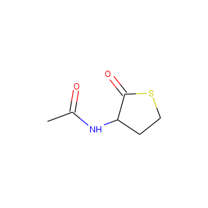
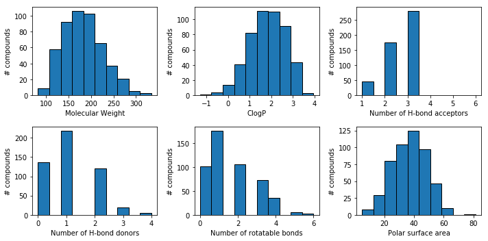
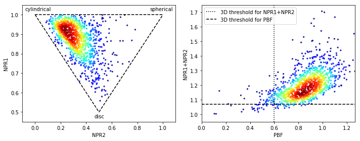
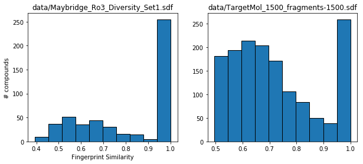
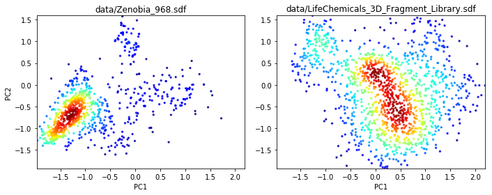

# [Simplified Molecular Input Line Entry System (SMILES)](https://www.daylight.com/dayhtml/doc/theory/theory.smiles.html)

## Advantages:
- Efficient: smaller data files

## Disadvantages:
- Only capable of encoding 2D structure information
- Can only include one identifier for each compound (i.e. no other molecule attributes)

    CC(=O)NC1CCSC1=O
    

# [Structure Data File (SDF)](http://www.structuralchemistry.org/pcsb/capp_cdf.php)

## Advantages:
- Capable of encoding 3D coordinates
- Can include as many properties for each molecule as desired

## Disadvantages:
- Larger files (10 $-$ 100 $\times$ more memory)

    
         RDKit          2D
    
     10 10  0  0  0  0  0  0  0  0999 V2000
        4.6250   -5.5000    0.0000 C   0  0  0  0  0  0  0  0  0  0  0  0
        5.3417   -4.2542    0.0000 N   0  0  0  0  0  0  0  0  0  0  0  0
        4.6292   -4.6750    0.0000 C   0  0  0  0  0  0  0  0  0  0  0  0
        3.9167   -5.9167    0.0000 S   0  0  0  0  0  0  0  0  0  0  0  0
        6.0542   -4.6625    0.0000 C   0  0  0  0  0  0  0  0  0  0  0  0
        5.3417   -5.9125    0.0000 O   0  0  0  0  0  0  0  0  0  0  0  0
        6.0667   -5.4875    0.0000 O   0  0  0  0  0  0  0  0  0  0  0  0
        3.2042   -4.6667    0.0000 C   0  0  0  0  0  0  0  0  0  0  0  0
        3.2042   -5.4917    0.0000 C   0  0  0  0  0  0  0  0  0  0  0  0
        6.7667   -4.2417    0.0000 C   0  0  0  0  0  0  0  0  0  0  0  0
      2  3  1  0
      3  1  1  0
      4  1  1  0
      5  2  1  0
      6  1  2  0
      7  5  2  0
      8  3  1  0
      9  4  1  0
     10  5  1  0
      8  9  1  0
    M  END
    
    

        
You appear to be running in JupyterLab (or JavaScript failed to load for some other reason).  You need to install the 3dmol extension:  
        <tt>jupyter labextension install jupyterlab_3dmol</tt>

        

## 2D molecules can be converted to [3D using RDKit](https://www.rdkit.org/docs/GettingStartedInPython.html#working-with-3d-molecules)
- 3D structure coordinates are needed to calculate 3D molecular descriptors (see normalized principle moment ratio and plane of best fit later on)
- After 3D coordinates are generated, they can be saved in SDF format

    
         RDKit          3D
    
     19 19  0  0  0  0  0  0  0  0999 V2000
       -1.3912   -0.7729    1.3471 C   0  0  0  0  0  0  0  0  0  0  0  0
        0.8149   -0.2635    0.4168 N   0  0  0  0  0  0  0  0  0  0  0  0
       -0.5829    0.1418    0.4393 C   0  0  0  0  0  0  0  0  0  0  0  0
       -3.0360   -0.9679    0.7518 S   0  0  0  0  0  0  0  0  0  0  0  0
        1.7695    0.5369   -0.1621 C   0  0  0  0  0  0  0  0  0  0  0  0
       -0.9751   -1.3091    2.3644 O   0  0  0  0  0  0  0  0  0  0  0  0
        1.5013    1.5607   -0.7817 O   0  0  0  0  0  0  0  0  0  0  0  0
       -1.2598    0.0308   -0.9249 C   0  0  0  0  0  0  0  0  0  0  0  0
       -2.7563    0.1070   -0.6829 C   0  0  0  0  0  0  0  0  0  0  0  0
        3.1829    0.0599    0.0334 C   0  0  0  0  0  0  0  0  0  0  0  0
        1.1099   -0.9218    1.1331 H   0  0  0  0  0  0  0  0  0  0  0  0
       -0.6496    1.1641    0.8313 H   0  0  0  0  0  0  0  0  0  0  0  0
       -0.9370    0.8272   -1.6038 H   0  0  0  0  0  0  0  0  0  0  0  0
       -1.0022   -0.9206   -1.4107 H   0  0  0  0  0  0  0  0  0  0  0  0
       -3.0643    1.1273   -0.4334 H   0  0  0  0  0  0  0  0  0  0  0  0
       -3.3289   -0.2370   -1.5482 H   0  0  0  0  0  0  0  0  0  0  0  0
        3.6838    0.7108    0.7545 H   0  0  0  0  0  0  0  0  0  0  0  0
        3.2128   -0.9696    0.4012 H   0  0  0  0  0  0  0  0  0  0  0  0
        3.7081    0.0959   -0.9251 H   0  0  0  0  0  0  0  0  0  0  0  0
      2  3  1  0
      3  1  1  0
      4  1  1  0
      5  2  1  0
      6  1  2  0
      7  5  2  0
      8  3  1  0
      9  4  1  0
     10  5  1  0
      8  9  1  0
      2 11  1  0
      3 12  1  0
      8 13  1  0
      8 14  1  0
      9 15  1  0
      9 16  1  0
     10 17  1  0
     10 18  1  0
     10 19  1  0
    M  END
    
    

        
You appear to be running in JupyterLab (or JavaScript failed to load for some other reason).  You need to install the 3dmol extension:  
        <tt>jupyter labextension install jupyterlab_3dmol</tt>

        

## Additional molecular properties are stored for each molecule after the end of the compound structure coordinates (M END) and before the compound delimiter ($\$\$\$\$$)

    ['Code',
     'Structure_smiles',
     'Appearance',
     'casno',
     'product_name',
     'c_log_p',
     'acd_code',
     'Flexibility',
     'PSA',
     'h_bond_donors',
     'h_bond_acceptors',
     'parent_mw',
     'Heavy_Atom_Count',
     'PAINS_Free',
     'Set']

# 2D descriptors:
## [a common school of thought](http://practicalfragments.blogspot.com/2011/11/pushing-rule-of-3.html) holds that fragment libraries should contain molecules with the following attributes:
- Molecular Weight $\lt$ 300 g/mol
- ClogP $\le$ 3
- Number of hydrogen bond donors $\le$ 3
- Number of hydrogen bond acceptors $\le$ 3
- Number of rotatable bonds $\le$ 3
- Polar surface area $\le$ 60 Å

    HBox(children=(IntProgress(value=0, description='calculating...', max=500, style=ProgressStyle(description_wid…

    
    

# [3-dimensionality (vs. flat structures) as a strategy to increase library diversity](https://blogs.sciencemag.org/pipeline/archives/2013/08/08/the_3d_fragment_consortium)
## Plots describing molecule 3D character depicted below
- [2-dimensional normalized ratios of principle moments of inertia](https://pubs.acs.org/doi/full/10.1021/ci025599w)
- [plane of best fit (PBF) score versus sum of NPRs](https://pubs.acs.org/doi/pdfplus/10.1021/ci300293f)

    HBox(children=(IntProgress(value=0, description='calculating...', max=1200, style=ProgressStyle(description_wi…

# [Fingerprinting and molecular similarity](https://www.rdkit.org/docs/GettingStartedInPython.html#fingerprinting-and-molecular-similarity)
## [click here for a more detailed explanation of the theory behind fingerprints](https://www.daylight.com/dayhtml/doc/theory/theory.finger.html)
- in general, molecular substructures are converted into bitmaps that can be compared mathematically for similarity

## Comparing nearest-neighbor similarity between two libraries
- example use case: would combining two different compound libraries lead to substantial redundancy? 
- in the example shown below, each compound fingerprint in one library is compared to each compound fingerprint in another and the highest similarity score is recorded
- here, scoring ranges from 0.0 (no similarity) to 1.0 (structurally identical)
- e.g. if a compound is associated with a score of 1.0, this means the same compound exists in both libraries

    HBox(children=(IntProgress(value=0, description='calculating 1...', max=500, style=ProgressStyle(description_w…

    HBox(children=(IntProgress(value=0, description='calculating 2...', max=1500, style=ProgressStyle(description_…

# 2D depictions of molecular fingerprints:
- fingerprint bitmaps (here we used 2048 bits) can be decomposed using statistical techniques like [Principle component analysis (PCA)](https://en.wikipedia.org/wiki/Principal_component_analysis) to allow for visualization and comparison of library diversity.
- here we fit a [pca model](https://scikit-learn.org/stable/modules/generated/sklearn.decomposition.IncrementalPCA.html) on a set of \~348 million fragments (MW $\le$ 350 g/mol) downloaded from the [ZINC database](http://zinc15.docking.org/tranches/home/#)
- the model (loaded here as 'ipca.pkl') is then used to project 2048 bit [Morgan Fingerprints](https://www.rdkit.org/docs/GettingStartedInPython.html#morgan-fingerprints-circular-fingerprints) calculated from the compound libraries analyzed here onto two dimensions for visual comparison.

